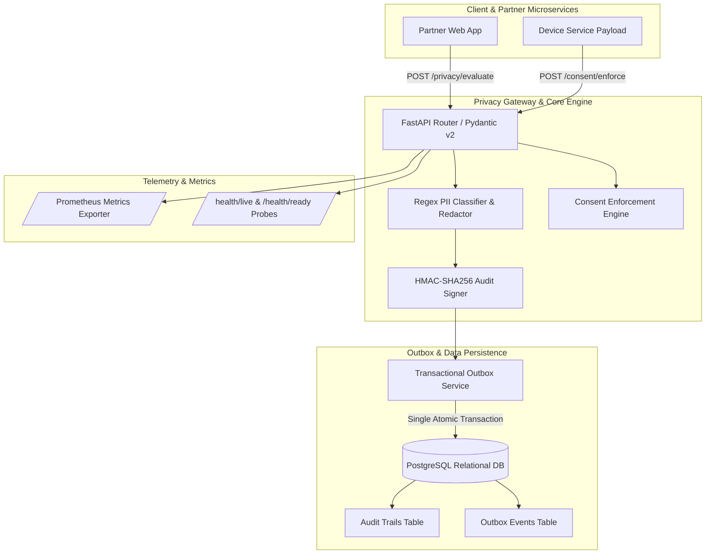
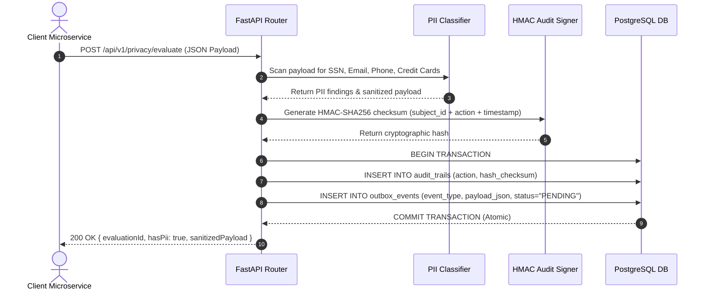
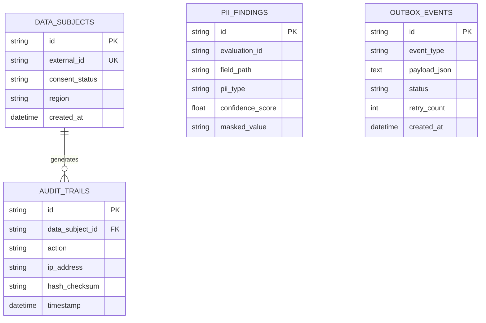

# TrustGuard Privacy Platform

[](https://rahul0443.github.io/trustguard-privacy-platform/)
[](https://github.com/rahul0443/trustguard-privacy-platform/actions)
[](https://www.python.org/)
[](https://fastapi.tiangolo.com/)
[](https://www.postgresql.org/)
[](https://www.sqlalchemy.org/)
[](https://www.docker.com/)

Live Interactive Control Plane: [https://rahul0443.github.io/trustguard-privacy-platform/](https://rahul0443.github.io/trustguard-privacy-platform/)

An enterprise-grade Data Privacy Governance, PII Classifier and Audit Outbox Platform. Built to adhere to software engineering and data privacy standards: automated PII data classification, transactional outbox dual-write guarantees, and HMAC-SHA256 audit integrity signatures.

---

## Table of Contents
- [Live Web Interactive Sandbox](#live-web-interactive-sandbox)
- [System Architecture and Data Flow](#system-architecture-and-data-flow)
- [Transactional Outbox Sequence Diagram](#transactional-outbox-sequence-diagram)
- [Entity-Relationship (ER) Database Model](#entity-relationship-er-database-model)
- [Key Engineering Highlights](#key-engineering-highlights)
- [API Reference and JSON Samples](#api-reference-and-json-samples)
- [Architecture Trade-Off Analysis](#architecture-trade-off-analysis)
- [Observability and Operational Excellence](#observability-and-operational-excellence)
- [Local Installation and Docker Setup](#local-installation-and-docker-setup)
- [Running PyTest Test Suite](#running-pytest-test-suite)
- [License and Author](#license-and-author)

---

## Live Web Interactive Sandbox

Try out the live privacy classification engine directly in your browser:  
[Launch Live Privacy Sandbox](https://rahul0443.github.io/trustguard-privacy-platform/)

* PII Sanitizer: Input any JSON payload containing SSNs, Emails, or Phone Numbers and watch live redaction ([REDACTED-SSN], [REDACTED-EMAIL]).
* HMAC Non-Repudiation Signer: Generate tamper-proof HMAC-SHA256 checksum signatures for compliance audits.
* Outbox Monitor: Inspect live transactional audit outbox event logs and Chart.js distribution breakdowns.

---

## System Architecture and Data Flow



---

## Transactional Outbox Sequence Diagram

Illustrates dual-write consistency without distributed lock overhead:



---

## Entity-Relationship (ER) Database Model

Relational PostgreSQL schema managed via SQLAlchemy 2.0 ORM:



---

## Key Engineering Highlights

### 1. Automated PII Classifier and Data Masking
Deterministic regular expression classifiers evaluating payload JSON structures for SSNs, emails, phone numbers, and credit card numbers, outputting sanitized JSON ([REDACTED-SSN], [REDACTED-EMAIL]).

### 2. Transactional Outbox Pattern
Guarantees dual-write consistency by persisting domain state changes and event logs into PostgreSQL within a single atomic SQL transaction, avoiding out-of-sync dual-write failures.

### 3. HMAC-SHA256 Audit Integrity
Signs every audit trail entry with a secret-keyed HMAC-SHA256 signature calculated over data_subject_id:action:timestamp to ensure audit integrity and non-repudiation.

### 4. Operational Excellence (OE)
* Prometheus Metrics (`/metrics`): Tracks PII evaluations count, findings by type, and consent decisions.
* Health Probes (`/health/live`, `/health/ready`): Kubernetes liveness and readiness probes.

---

## API Reference and JSON Samples

### Evaluate PII Payload
`POST /api/v1/privacy/evaluate`

**Request Body:**
```json
{
  "data_subject_id": "sub_usr_998877",
  "payload": {
    "user_name": "Alice Johnson",
    "email": "alice.johnson@amazon.com",
    "ssn": "123-45-6789",
    "phone": "623-280-6332"
  }
}
```

**Response (`200 OK`):**
```json
{
  "evaluation_id": "eval_4f89a2b1c3d4",
  "data_subject_id": "sub_usr_998877",
  "has_pii": true,
  "findings_count": 3,
  "findings": [
    {
      "field_path": "email",
      "pii_type": "EMAIL",
      "confidence_score": 0.99,
      "masked_value": "[REDACTED-EMAIL]"
    },
    {
      "field_path": "ssn",
      "pii_type": "SSN",
      "confidence_score": 0.99,
      "masked_value": "[REDACTED-SSN]"
    }
  ],
  "sanitized_payload": {
    "user_name": "Alice Johnson",
    "email": "[REDACTED-EMAIL]",
    "ssn": "[REDACTED-SSN]",
    "phone": "[REDACTED-PHONE]"
  },
  "evaluated_at": "2026-09-22T21:15:00.000Z"
}
```

---

## Architecture Trade-Off Analysis

| Choice | Alternative Considered | Rationale |
| :--- | :--- | :--- |
| **Transactional Outbox Pattern** | Direct Kafka Dual-Write | Direct dual-writes to DB and Kafka can fail if Kafka is down, leaving DB out of sync. Outbox pattern guarantees atomic persistence. |
| **HMAC-SHA256 Signatures** | Plaintext Log Files | HMAC signatures prevent audit log tampering or unauthorized alteration in database stores. |

---

## Local Installation and Docker Setup

```bash
# Clone the repository
git clone https://github.com/rahul0443/trustguard-privacy-platform.git
cd trustguard-privacy-platform

# Launch web app, PostgreSQL, and Redis via Docker Compose
docker-compose up --build -d

# Verify liveness probe
curl http://localhost:8000/health/live
```

---

## Running PyTest Test Suite

```bash
# Install local dependencies
pip install -r requirements.txt

# Execute automated PyTest suite
TESTING=1 pytest tests/ --cov=app
```

---

## License and Author

Developed by Rahul Muddhapuram (rmuddhap@asu.edu).  
Licensed under the [MIT License](LICENSE).
